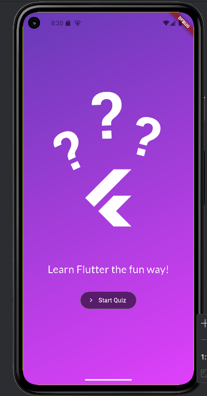
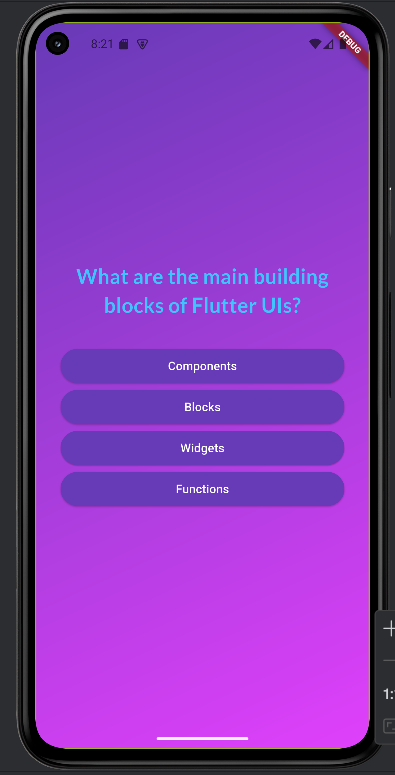
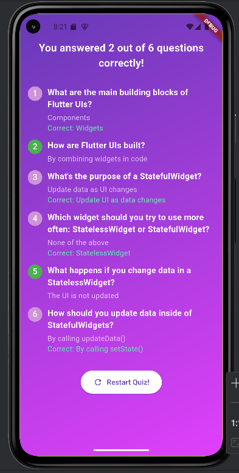

# Flutter Quiz App

A sleek, interactive Flutter app for practicing and assessing development knowledge through fun quizzes.  
Designed with modular code, clear UI, and practical learn-by-doing features — ideal for junior developer/QA portfolios or skill-tech screening demos.

---

## 📱 Features

- **Multiple-choice Quizzes**: Answer engaging questions on Flutter, widgets, and development best practices.
- **Randomized Answers**: Options are shuffled for each session to keep testing fair and challenging.
- **Progressive Navigation**: Clean transitions between question, answer, and result screens.
- **Instant Feedback**: See your answers and correct options at the end of the quiz.
- **Modern, Vibrant UI**: Beautiful color gradients, well-designed buttons, and responsive layout.

---

## 🛠️ Tech Stack & Structure

- **Flutter** & **Dart**: For robust cross-platform mobile UI.
- **Widget Structure**:
  - `main.dart`: Entry point.
  - `lib/models/quiz_questions.dart`: Model for question/answer logic.
  - `lib/questions_screen.dart`: Shows question, options, handles progress.
  - `lib/answer_button.dart`: Option buttons for user interaction.
  - `lib/results_screen.dart`: Displays quiz results and user summary.
  - `lib/questions_summary/`: Components for detailed results.
- **Modular Organization**: Every feature (question, answer, summary) is its own file/class for clarity and scalability.
- **Material Design**: Uses theming, padding, and elevation for a polished mobile feel.

---

## 🚀 Getting Started

1. **Clone the repository**

git clone https://github.com/phyowaikyaw-mobiledev/flutter_quizz_app.git
cd flutter_quizz

2. **Install packages**

flutter pub get

3. **Run the app**

flutter run

---

## ✨ Why This Project

- Shows solid understanding of **state management, navigation, and UI design** in Flutter.
- Written with **readability and testing focus** — structure is easy to extend and QA.
- Great for self-study, code challenges, or showcasing practical Flutter/Dart skills to hiring managers.

---

## 📸 Screenshots

---

## 👤 Author

Phyo Wai Kyaw  
Junior Software Tester & Flutter Developer  
Bangkok, Thailand  
Email: phyowaikyawdeveloper@gmail.com  
GitHub: https://github.com/phyowaikyaw-mobiledev

---

## 🏷️ License

MIT License

---

## 🙏 Note

This project is designed to help users (and interviewers!) quickly check Flutter knowledge and UI logic skills.  
It follows clean code principles, with thorough separation of concerns and an inviting user interface.

---
